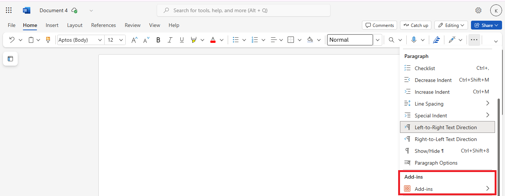
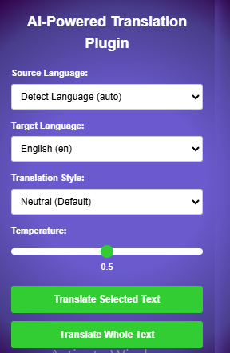
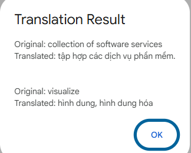
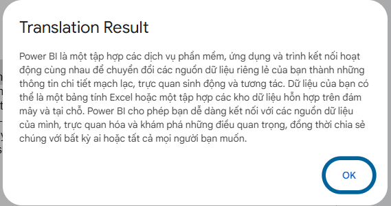

# AI-Powered-Translation-Plugin-for-Word-Processing-Applications

## Student information
**Name:** Nguyễn Hoàng Trung Kiên
**Student's ID:** 22127478
**Subject:** Natural Language Processing and Appplication

## 0. Introduction

This add-in works with any word processing application and helps translate selected text or the entire document using AI. It supports multiple languages and enhances translations based on user preferences.

**Platforms support:** Google Docs and Microsoft Word Online.

**Translation AI model used:** Gemini 2.0 Flash.

**Language packages from:** [LibreTranslate Languages](https://libretranslate.com/languages)

## 1. Development Overview
### 1.1. Google Docs

Open **Google Docs** and navigate to **Extensions > Apps Script**. In the **Apps Script editor**, write the backend logic in the `Code.gs` file and create a `Sidebar.html` file for the frontend interface. Once the coding process is complete, click **"Run"** and select `onOpen()`, or deploy it using the available deployment options to integrate it as a **Google Docs add-on**.

Go back to your Google Docs file, and you'll see a new **"AI Translator"** menu in the toolbar. Click it and the add-in sidebar will appear.

### 1.2. Microsoft Word Online

To develop an AI Translator add-in for Microsoft Word Online, I used the Yeoman Generator for Office Add-ins. This provides a structured template and necessary configurations to create an Office add-in.

First, install these requirements:
- Node.js: Can be downloaded at [Nodejs](https://nodejs.org/en).
- Yeoman and generator-office:

```
npm install -g yo generator-office
```

Generate a new Word add-in using Yeoman:

```
yo office
```

Make sure to select:

**Project Type:** Office Add-in Task Pane project

**Framework:** Choose JavaScript (or TypeScript if preferred)

**Office Client application:** Word

This will scaffold a new Office Add-in project with the necessary files.

We then modify `taskpane.html`, `taskpane.js`, `taskpane.css` and `manifest.xml`

Next, we run the add-in locally. Navigate to the project folder and start the development server:
```
cd your-project-name
npm install
npm start
```
This will start a local web server. 

Now on [Microsoft Word Online](https://word.cloud.microsoft/), you will see the Add-ins option. (Home > ... > Add-ins)



Click More add-ins and go to my add-ins, we can see Upload add-in option, upload the manifest.xml file in the project folder that we use Yeoman to generate before.

Then the add-in appears as a sidebar.

## 2. Usage guideline

Before running, make sure you paste the API key of Gemini 2.0 Flash in the code. For **Google Docs**, add API key to `code.gs`. For **Microsoft Word Online**, add it to `taskpane.js`.

When starting the plugin, you can see its UI:



You can select a piece of text that you want to translate. For **Google Docs** you can select more than one piece of text and translate it too, while **Microsoft Word Online** does not provide this. Or you can click translate whole text and it will translate all text in document. You can select source language and target language that you want to translate. Additionally, the plugin provides you translation style and temperature also. Temperature is for controlling randomness and creativity of the translation output.

Output will be shown as a pops-up.

- Select one or many text



- Whole document 


